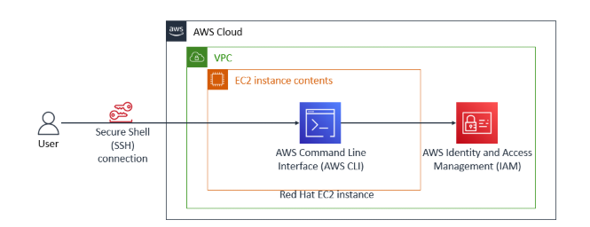
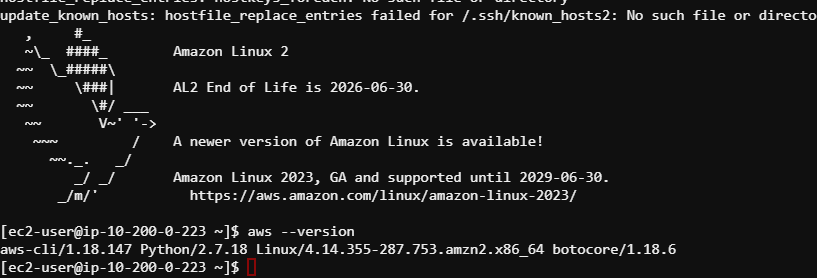
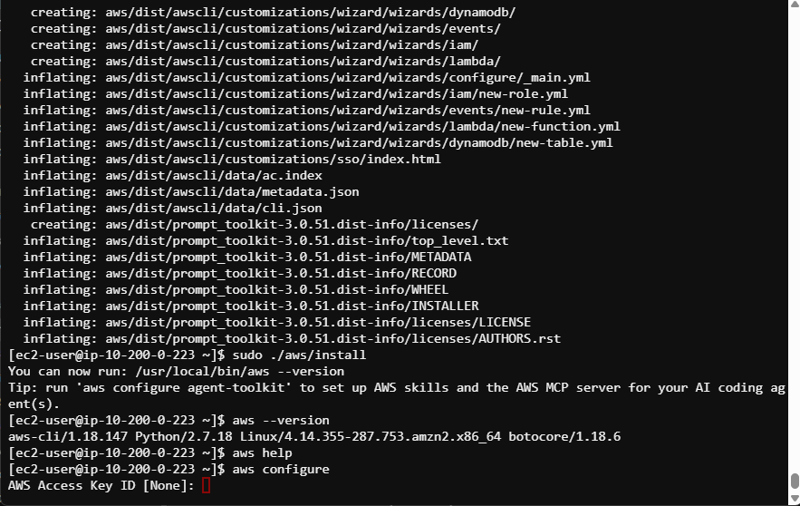
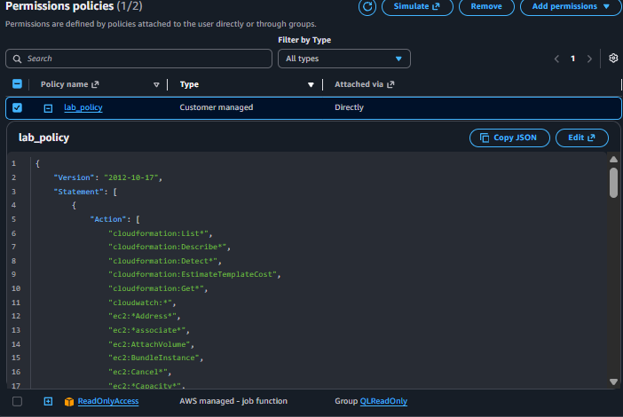
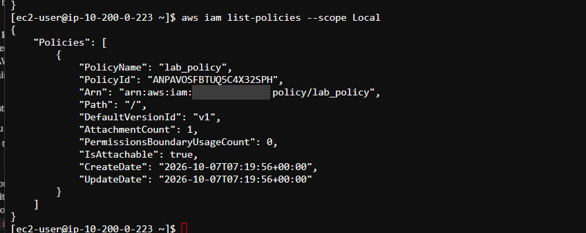
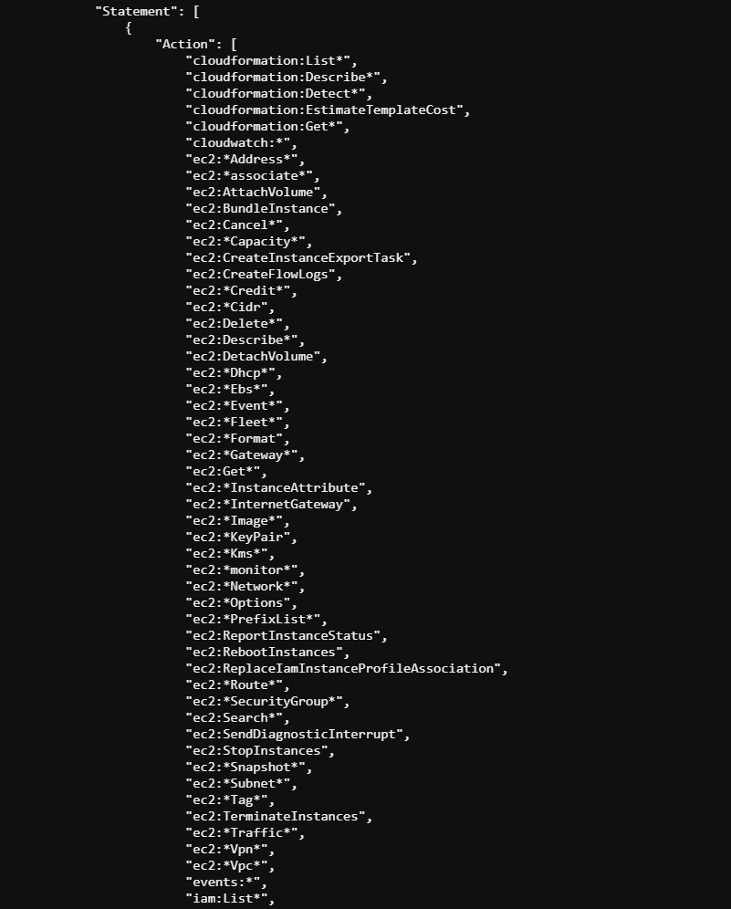

# Install and Configure the AWS CLI

## Goal
Connect to an EC2 instance over SSH, install AWS CLI v2, connect it to an AWS account with an access key, and use it to pull an IAM policy from the terminal.

## Architecture


## What I did

**1. Connected over SSH.** I downloaded the PEM key file from the lab and connected to the EC2 instance as `ec2-user`.

**2. Checked what was already installed.** The instance already had AWS CLI v1, even though the lab expects a fresh machine.



**3. Ran the v2 installer.** The terminal kept using the older v1, probably because it was still pointing to the old location, but v1 worked fine for the rest of the lab. Then I ran `aws configure` to enter my access key, secret key, region (`us-west-2`), and output format (`json`).



**4. Looked at the IAM user in the console.** I opened the `awsstudent` user and read the `lab_policy` permissions before using the CLI.



## Challenge
Download the `lab_policy` document using only the CLI.

First I listed the customer managed policies and found the policy ARN and default version:

```
aws iam list-policies --scope Local
```



Then I fetched that version and saved it to a file:

```
aws iam get-policy-version --policy-arn arn:aws:iam::<account-id>:policy/lab_policy --version-id v1 > lab_policy.json
```

Printing the file with `cat lab_policy.json` showed the same policy I saw in the console:



## Troubleshooting
- **Wrong value pasted as the access key.** I pasted the user ARN instead of the access key ID. Fixed by re-running `aws configure` and using the AccessKey from the lab's Details panel.
- **Partial credentials error.** The secret key didn't save on my first try, so the CLI said it was missing `aws_secret_access_key`. Fixed by running `aws configure` again.
- **SignatureDoesNotMatch.** The account had two access keys, and I used the ID of one with the secret of the other. Using the matching AccessKey and SecretKey pair from the Details panel fixed it.


## What I learned
I learned how to install and configure the AWS CLI and connect it to an account using an access key and secret key. I also learned that the keys have to be a matching pair, because mixing them up gave me a SignatureDoesNotMatch error. In the IAM console, I looked at a user, its access keys, and its policy, then pulled the same policy from the terminal. That showed me the console and the CLI are two ways to do the same job.
