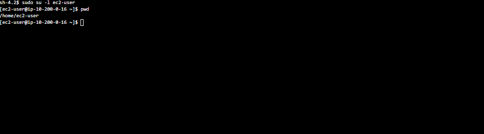
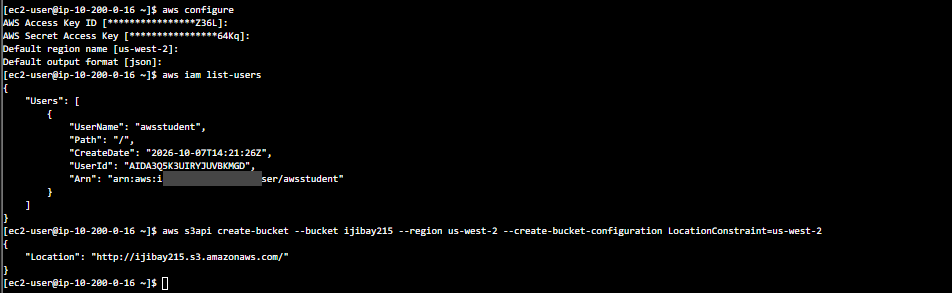
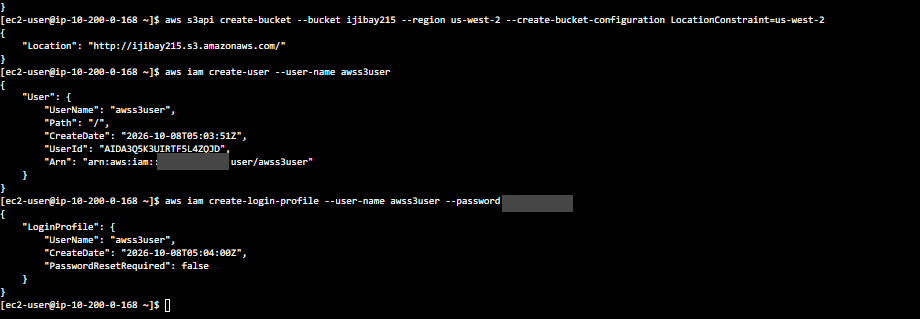
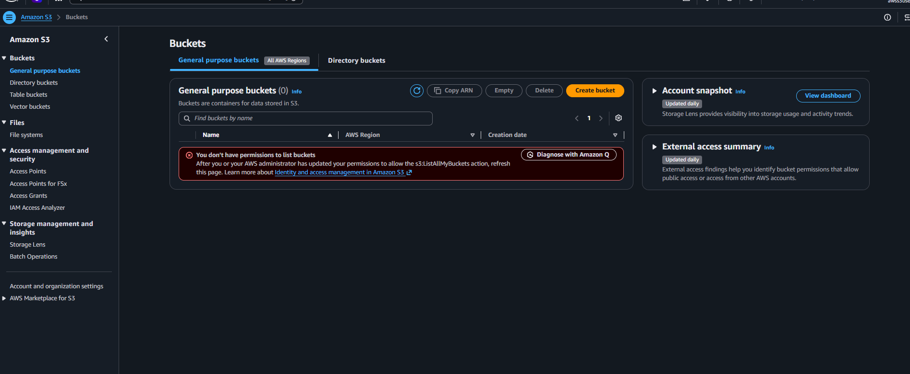
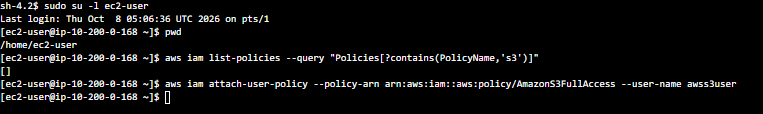
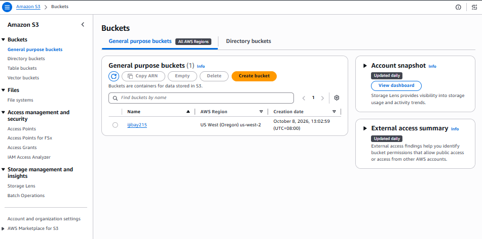
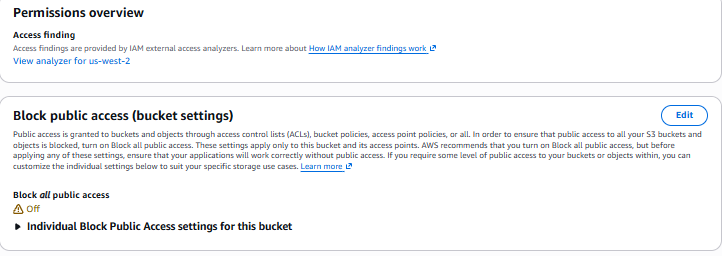
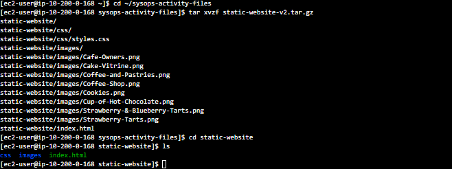
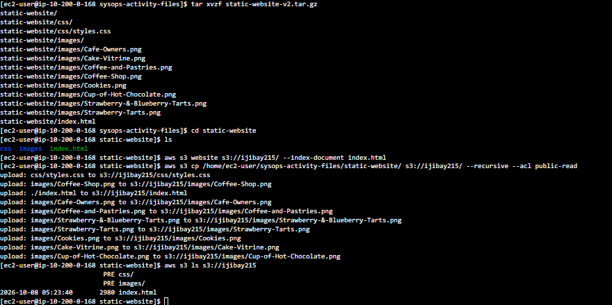
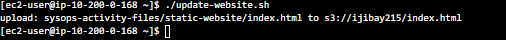

# Host a Static Website on S3

## Goal
Use the AWS CLI from an EC2 instance to create an S3 bucket, create a new IAM user with S3 access, host a café website straight from the bucket, and write a script that pushes site updates.

## What I did

**1. Connected and configured the CLI.** I opened a browser terminal on the instance with Session Manager (no SSH key needed), switched to `ec2-user`, and ran `aws configure` with the lab's access key, region `us-west-2`, and `json` output.



**2. Created the bucket.** Bucket names are unique across all of AWS, so I used my own name plus numbers.

```
aws s3api create-bucket --bucket ijibay215 --region us-west-2 --create-bucket-configuration LocationConstraint=us-west-2
```



**3. Created a new IAM user.** I made `awss3user` and gave it a console password.

```
aws iam create-user --user-name awss3user
aws iam create-login-profile --user-name awss3user --password <password>
```



**4. Showed that a new user starts with no permissions, then fixed it.** I signed in to the console as `awss3user` and S3 said I wasn't allowed to list buckets.



Then, as the admin, I attached the AWS managed S3 policy to the user.

```
aws iam attach-user-policy --policy-arn arn:aws:iam::aws:policy/AmazonS3FullAccess --user-name awss3user
```



After refreshing, the bucket showed up.



**5. Opened the bucket to the public, on purpose.** For a website, visitors need to read the files without signing in. I turned off Block all public access and enabled ACLs under Object Ownership so each file could be marked public.



**6. Unpacked the website files** on the instance.

```
cd ~/sysops-activity-files
tar xvzf static-website-v2.tar.gz
cd static-website
ls
```



**7. Turned on website hosting and uploaded the site.**

```
aws s3 website s3://ijibay215/ --index-document index.html
aws s3 cp /home/ec2-user/sysops-activity-files/static-website/ s3://ijibay215/ --recursive --acl public-read
```



The site was live at the bucket's website endpoint.


**8. Wrote a script so updates are repeatable.** I saved the upload command in `update-website.sh` with vi and made it executable.

```
#!/bin/bash
aws s3 cp /home/ec2-user/sysops-activity-files/static-website/ s3://ijibay215/ --recursive --acl public-read
```

```
chmod +x update-website.sh
```

I changed the section colors in `index.html` (aquamarine to gainsboro, orange to cornsilk), ran `./update-website.sh`, and refreshed the page.


## Challenge: `cp` vs `sync`
My script re-uploaded every file each time, even when only one changed. I swapped `cp` for `sync`:

```
#!/bin/bash
aws s3 sync /home/ec2-user/sysops-activity-files/static-website/ s3://ijibay215/ --acl public-read
```

After changing one color, the script uploaded only `index.html`.




`sync` is more efficient because it compares the local folder with the bucket and uploads only what changed, while `cp` copies everything every time.

## Troubleshooting
- **Typed the placeholder literally.** I pasted `<your-bucket-name>` into the command and bash read the `<` as a file redirect, so it failed. Fixed by using a real bucket name.
- **Empty policy search.** My `list-policies` filter for `s3` returned `[]` because the filter is case sensitive and the policy name has a capital `S3`. I attached `AmazonS3FullAccess` by its known name and it worked.
- **Signed in as the wrong user.** Opening the Session Manager link while signed in as `awss3user` gave a "not authorized to perform ssm:StartSession" error. Fixed by keeping the admin in my normal browser window and using an incognito window for `awss3user`.

## Security note
I turned off Block all public access only because a public website requires it. In a real account, buckets should stay private unless they truly need to be public, and public sites are usually served through CloudFront instead of an open bucket. The lab account and its credentials were deleted when the lab ended.

## What I learned
I learned how to create and configure an S3 bucket from the CLI and host a static website from it. I saw that a new IAM user starts with no permissions and only gets access once a policy is attached. I also learned how to turn a long command into a reusable script, and that `aws s3 sync` is the better choice for repeated updates because it only sends changed files.
